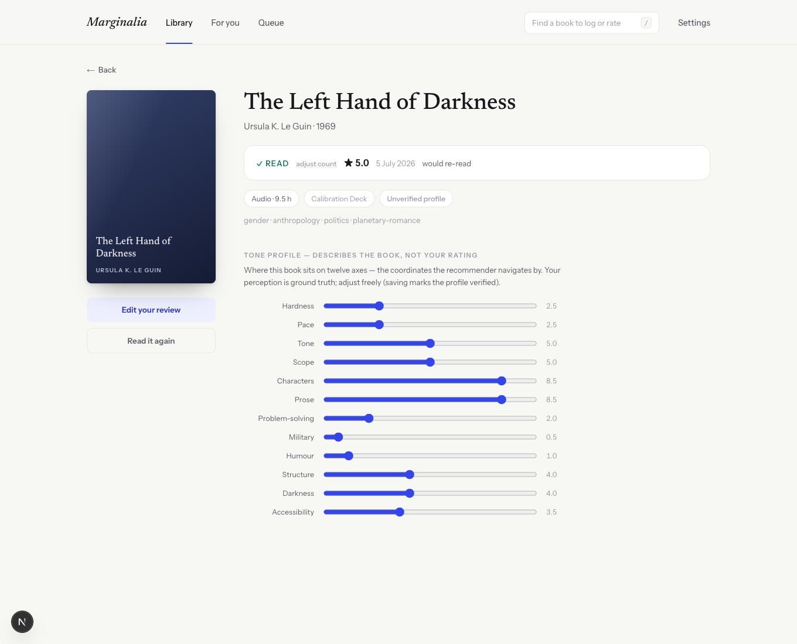

# Marginalia

A personal book tracker that recommends your next read with explicit mathematics instead of vibes — and an honest write-up of why that didn't fully work.


| The library | The review flow |
|---|---|
|  |  |



## Why I built it

I'm Padraig. Every time I finish a book, the same routine:

- trawl online reviews
- ask an AI what to read next
- cross-reference, second-guess, eventually pick something

It works, sort of. But it always feels incomplete — the suggestions don't really know what *I* rate highly, and I can't see why any recommendation was made. A book recommended mathematically, from my own ratings, with the working shown, seemed like it would fit perfectly.

## The idea

- Rate every book you finish: half-star verdict + a few generic sliders (prose, pace, ideas…)
- Every book carries a **tone profile**: twelve axes (pace, darkness, humour, scope…) describing the book itself
- From your ratings the app computes a **taste vector**, then for every candidate book:
  - a predicted rating with an honest ± band (k-nearest-neighbours over *your own* rated books)
  - the three books driving the prediction, with similarity scores
  - plain-English reasoning generated from the actual numbers
- A **discovery slider** trades safe bets for novelty — from "comfort shelf" to "terra incognita"
- Local-first: everything lives in your browser, one-click JSON export, no accounts

## Where it fell short

The mathematics was never the problem. The inputs were.

- The recommender is only as good as the tone profiles it navigates by
- Only the 20 calibration-deck titles have hand-authored profiles; **every other book is classified automatically** — keyword heuristics over catalogue subjects, plus inference from similar books
- That automatic classification turned out to be the weak link:
  - blank or wrong profiles produced absurd recommendations (Shakespeare's *Julius Caesar*, legal thrillers, graphic novels)
  - flat "unknown" profiles made every book look similar, so predictions collapsed to the average and every confidence band saturated
  - each fix — genre anchors, popularity floors, a gate that refuses to recommend unprofiled books — made the pool *safer* by making it *smaller*, which is the opposite of what a recommender is for
- With one user, only the few dozen books I've personally read and adjusted ever get trustworthy profiles

**What would actually fix it: more users.** The design already treats the reader's perception as ground truth — every profile is editable, and machine guesses are labelled *Unverified*. With many readers each correcting the profiles of books they know, every popular book would converge on accurate coordinates, and the same mathematics would work properly. That's the quiet advantage crowd platforms have: their data isn't smarter, there's just more of it. A single-user app has to bootstrap that knowledge from automated classification, and automated classification wasn't good enough.

## What held up

- The transparency is genuinely worth it — seeing *why* a book was picked (which books drove it, how similar, how confident) changes how much you trust a recommendation
- Rating on your own history beats generic star averages; the taste vector visibly shifts when you rate something
- Local-first worked: no backend, instant, data fully portable

## Running it

```bash
npm install
npm run dev     # http://localhost:3000
npm test        # recommender unit tests + deterministic fixture
npm run build
```

- Next.js (App Router) + TypeScript + Tailwind
- Dexie / IndexedDB, no server
- Book metadata from Open Library, with Google Books fallback
- The recommender is pure TypeScript in [`lib/recommender/`](lib/recommender/), unit-tested against a committed fixture

## More

- [`docs/01-WHITE-PAPER.md`](docs/01-WHITE-PAPER.md) — the original specification
- [`docs/03-ENGINEERING.md`](docs/03-ENGINEERING.md) — types, algorithm constants, acceptance criteria
- [`docs/04-GENRE-AGNOSTIC-PLAN.md`](docs/04-GENRE-AGNOSTIC-PLAN.md) — unbuilt plan for opening it beyond science fiction
